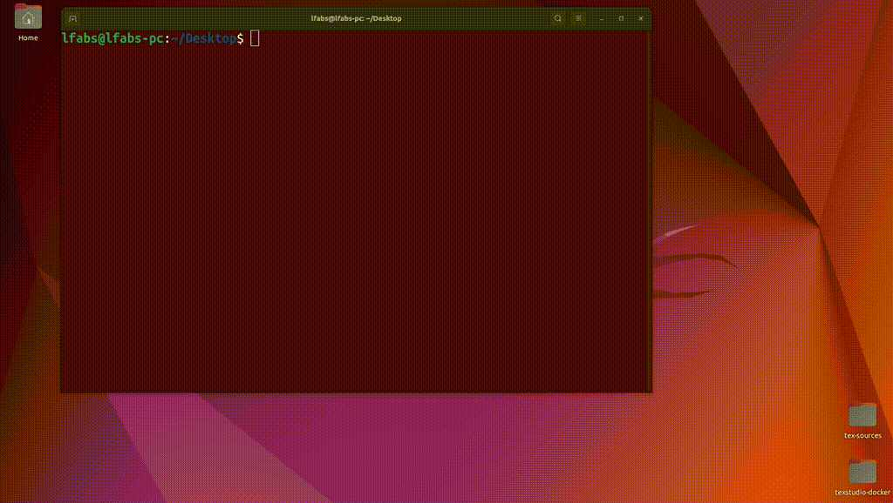

# texstudio-docker [](https://hub.docker.com/r/leofaber/texstudio-docker/)

This Docker image contains all latex packages and the TeXstudio editor.



## Based on
* Ubuntu 22.04
* TeX Live 2022
* TeXstudio 4.2.1 

## How to use the image

Run the following script:
```
export MOUNT_DIR=/host/path/to/tex/sources
./start_texstudio.sh
```

## Versions
At the moment only one version is supported:
* [leofaber/texstudio-docker](https://hub.docker.com/repository/docker/leofaber/texstudio-docker/general) 

## How to build the image
```
docker build -t texstudio:latest .
```

## License
See [LICENSE](LICENSE) file.